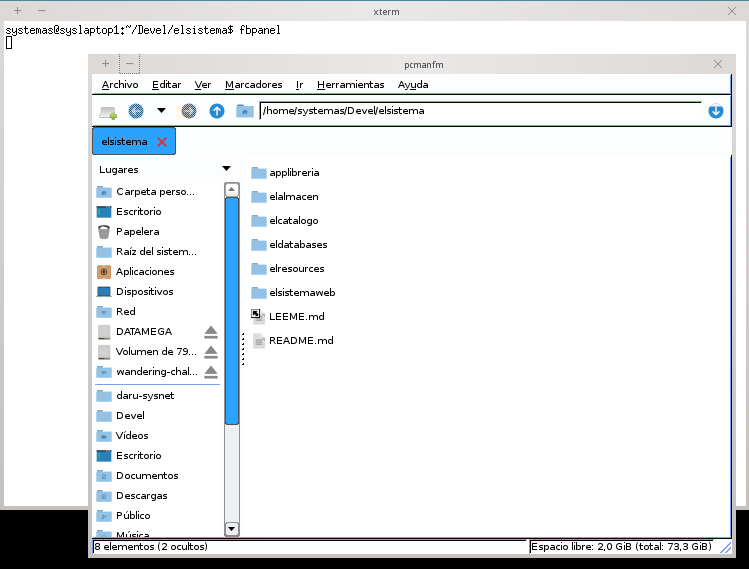

mlde : eggwm
============

A minimalist QT window manager for QT framework technology

This its a minimal implementation for a defult window manager into Moonlight Desktop.



## Build && Install

Requirements and QT5 framework installed with qmake and development headers, 
for propert install please see [docs/READMEinstall.md](docs/READMEinstall.md) file at [docs] directory.

```
qmake -makefile
make
make install
```

More info at the [docs] directory please for testing see [docs/READMEinstall.md] file.

## Status

Currently working and tested, but project are staled due lack of manpowers, 
if interesting please contact at the mail list in moonlightde:

[Mail list: moonlightde@googlegroups.com](https://groups.google.com/d/forum/moonlightde) Archived but still receive mails.

## LICENSE

Originally forked from https://code.google.com/p/eggwm/ See [LICENSE](LICENSE), 
the code was improved by https://github.com/xiangzhai that ported to QT5, 
original work made by https://github.com/JoseExposito that made to QT4, 
this porject are staled and a mantainer its need.
